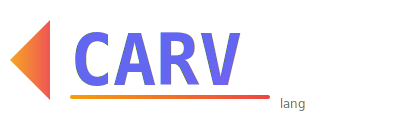

<p align="center">
  
</p>

<p align="center">
  <strong>A statically-typed language that compiles to C</strong>
</p>

<p align="center">
  <a href="#features">Features</a> •
  <a href="#quick-look">Quick Look</a> •
  <a href="#building">Building</a> •
  <a href="#where-things-stand">Status</a> •
  <a href="#docs">Docs</a>
</p>

---

# Carv

An ambitious little programming language I've been tinkering with.

---

## The Story

This project has been a long time coming. Back in September last year, I started working on something called **dyms** (Dynamic Yet Minimal Script) - first in Go, then rewrote it in Rust, then... i gave up. Life happened, motivation faded, School, yk the usual.

Fast forward to now right now and i'm back at it. Ported what I had to Go, cleaned things up, and renamed it Carv. The goal is still the same: build a language that compiles to C, eventually make it self-hosted (write the Carv compiler in Carv itself).

We'll see how far I get this time.

---

## What It Does

Carv compiles to C and runs natively. It has a tree-walking interpreter too for quick testing.

Features that actually work:
- Static typing with inference
- Pipe operator (`|>`) - my favorite part
- `let` / `mut` / `const` with proper immutability enforcement
- Compound assignment (`+=`, `-=`, `*=`, `/=`, `%=`, `&=`, `|=`, `^=`)
- Classes with methods
- Result types (`Ok`/`Err`) with pattern matching
- Hash maps
- `for-in` loops over arrays, strings, and maps
- **Closures** - first-class functions with environment capture
- **Module system** with `require` (Rust-inspired, package manager ready)
- **String interpolation** with `f"hello {name}"`
- **Ownership system** (move semantics, `clone()` for deep copy)
- **Borrowing** (`&T` / `&mut T`)
- **Interfaces** (`interface` / `impl` with vtable-based dynamic dispatch)
- **Async/await** (compiles to state machines)
- **Built-in `net`/`web` modules** for native TCP (`tcp_listen`, `tcp_accept`, `tcp_read`, `tcp_write`, `tcp_close`)
- Project config via `carv.toml`
- 40+ built-in functions (strings, files, process, environment, etc.)

---

## Quick Look

```carv
// string interpolation
let name = "World";
println(f"Hello, {name}!");
println(f"2 + 2 = {2 + 2}");

// pipes make everything nicer
10 |> double |> add(5) |> print;

// ownership: move semantics
let s = "hello";
let t = s;              // s is moved, now invalid
let u = s.clone();      // explicit deep copy

// borrowing: safe references
fn print_len(s: &string) -> int {
    return len(s);
}
let msg = "world";
print_len(&msg);        // immutable borrow

// error handling without exceptions
fn divide(a: int, b: int) {
    if b == 0 {
        return Err("nope");
    }
    return Ok(a / b);
}

let x = divide(10, 2)?;

// hash maps
let scores = {"alice": 100, "bob": 85};

// classes
class Point {
    x: int = 0
    y: int = 0
}

// closures
let multiplier = 3;
let triple = fn(x: int) -> int {
    return x * multiplier;
};
println(f"triple(5) = {triple(5)}");

// async/await
async fn fetch_data() -> int {
    return 42;
}

async fn carv_main() -> int {
    let value = await fetch_data();
    println(value);
    return 0;
}
```

### Modules

```carv
// math.carv
pub fn add(a: int, b: int) -> int {
    return a + b;
}

// main.carv
require { add } from "./math";
println(f"1 + 2 = {add(1, 2)}");

// builtin module
require "net" as net;
let listener = net.tcp_listen("127.0.0.1", 8080);
net.tcp_close(listener);
```

---

## Building

```bash
git clone https://github.com/dev-dami/carv
cd carv
make build
```

Then:
```bash
./build/carv run file.carv      # interpret
./build/carv build file.carv    # compile to binary
./build/carv emit-c file.carv   # emit generated C source
./build/carv init               # create new project with carv.toml
./build/carv repl               # mess around
```

For async programs compiled with `carv build`, use `async fn carv_main() -> int` as the async entrypoint.

---

## Where Things Stand

### Core Language
- [x] Lexer, parser, type checker
- [x] Tree-walking interpreter
- [x] C code generation
- [x] Static typing with inference

### Data Types & Structures
- [x] Primitives (int, float, string, bool, char)
- [x] Arrays and hash maps
- [x] Result types (`Ok`/`Err`) with pattern matching
- [x] Classes with methods

### Memory & Ownership
- [x] Ownership system (move semantics)
- [x] Borrowing (`&T` / `&mut T`)
- [x] Arena allocator in codegen
- [x] Automatic drop insertion

### Functional Features
- [x] First-class functions
- [x] Closures with capture
- [x] Pipe operator (`|>`)
- [x] Higher-order functions

### Advanced Features
- [x] Interfaces (`interface`/`impl` with vtables)
- [x] Module system (`require`)
- [x] Built-in `net`/`web` modules
- [x] String interpolation (`f"..."`)
- [x] Async/await (state-machine codegen + runtime bootstrap)

### Tooling
- [x] Project config (`carv.toml`)
- [x] REPL
- [x] Build scripts
- [ ] Package manager
- [ ] Self-hosting
- [ ] LSP / Editor support

---

## Docs

- [Language Guide](docs/language.md)
- [Architecture](docs/architecture.md)
- [Built-ins](docs/builtins.md)
- [Contributing](CONTRIBUTING.md)

---

## License

MIT

---

*This is a hobby project. I work on it when I have the energy. No promises, no timelines.*
