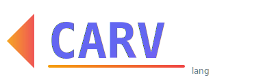

<p align="center">
  
</p>

<p align="center">
  <strong>A memory-safe language for embedded systems that compiles to C</strong>
</p>

<p align="center">
  <a href="#features">Features</a> •
  <a href="#quick-look">Quick Look</a> •
  <a href="#building">Building</a> •
  <a href="#where-things-stand">Status</a> •
  <a href="#docs">Docs</a>
</p>

---

# Carv

A programming language designed for embedded systems (ARM Cortex-M0 through M7). Compiles to C, runs natively on bare metal.

---

## The Story

This started as a hobby project called **dyms** back in September. After a few rewrites between Go and Rust, it became **Carv** — a language that compiles to C with the goal of being safe, small, and suitable for microcontrollers.

The focus is now squarely on **embedded systems**: sized integer types, volatile memory access, packed structs for register maps, and cross-compilation to ARM targets.

---

## What It Does

Carv compiles to C and targets embedded hardware (ARM Cortex-M series). No interpreter, no runtime — just clean C output that works with `gcc` or `arm-none-eabi-gcc`.

Features that actually work:
- **Sized integer types** (`u8`, `u16`, `u32`, `u64`, `i8`, `i16`, `i32`, `i64`, `f32`, `f64`, `usize`, `isize`)
- **`volatile<T>`** for memory-mapped I/O
- **`packed` classes** for register maps (`__attribute__((packed))`)
- **`static` variables** for BSS/data section placement
- **ARM cross-compilation** (`carv build --target arm`)
- Static typing with inference
- Method chaining with `.`
- `let` / `mut` / `const` with proper immutability enforcement
- Compound assignment (`+=`, `-=`, `*=`, `/=`, `%=`, `&=`, `|=`, `^=`)
- Classes with methods
- Result types (`Ok`/`Err`) with pattern matching
- `for-in` loops over arrays, strings, and maps
- Closures with environment capture
- Module system with `require`
- String interpolation with `f"hello {name}"`
- Ownership system (move semantics)
- Borrowing (`&T` / `&mut T`)
- Interfaces (`interface` / `impl` with vtable-based dispatch)
- Async/await (compiles to state machines)
- 40+ built-in functions

---

## Quick Look

```carv
// sized types for embedded
let counter: u32 = 0;
let flags: u8 = 0xFF;
let temperature: f32 = 23.5;

// volatile for hardware registers
let status: volatile<u32> = 0;

// packed struct for register maps
packed class GPIO_Regs {
    moder:   u32 = 0
    otyper:  u32 = 0
    ospeedr: u32 = 0
    pupdr:   u32 = 0
    idr:     u32 = 0
    odr:     u32 = 0
}

// static variables
static let buffer: [64]u8 = [0; 64];

// method chaining
let result = sensor.read().calibrate().to_celsius();

// ownership: move semantics
let s = "hello";
let t = s;              // s is moved, now invalid

// error handling without exceptions
fn divide(a: i32, b: i32) {
    if b == 0 {
        return Err("division by zero");
    }
    return Ok(a / b);
}

let x = divide(10, 2)?;

// classes
class Point {
    x: i32 = 0
    y: i32 = 0
}

// closures
let multiplier = 3;
let triple = fn(x: i32) -> i32 {
    return x * multiplier;
};
```

### Modules

```carv
// math.carv
pub fn add(a: i32, b: i32) -> i32 {
    return a + b;
}

// main.carv
require { add } from "./math";
println(f"1 + 2 = {add(1, 2)}");
```

---

## Building

```bash
git clone https://github.com/dev-dami/carv
cd carv
make build
```

Then:
```bash
./build/carv build file.carv               # compile to binary (host)
./build/carv build --target arm file.carv   # compile for ARM Cortex-M
./build/carv emit-c file.carv              # emit generated C source
./build/carv init                          # create new project with carv.toml
```

For ARM targets, you need `arm-none-eabi-gcc` installed.

---

## Where Things Stand

### Core Language
- [x] Lexer, parser, type checker
- [x] C code generation (AOT only)
- [x] Static typing with inference

### Embedded Features
- [x] Sized integer types (`u8`-`u64`, `i8`-`i64`, `f32`, `f64`, `usize`, `isize`)
- [x] `volatile<T>` for memory-mapped I/O
- [x] `packed` classes for register maps
- [x] `static` variable declarations
- [x] ARM cross-compilation (`--target arm`)

### Data Types & Structures
- [x] Primitives (int, float, string, bool, char + all sized variants)
- [x] Arrays and hash maps
- [x] Result types (`Ok`/`Err`) with pattern matching
- [x] Classes with methods

### Memory & Ownership
- [x] Ownership system (move semantics)
- [x] Borrowing (`&T` / `&mut T`)
- [x] Arena allocator in codegen
- [x] Automatic drop insertion

### Functional Features
- [x] First-class functions
- [x] Closures with capture
- [x] Method chaining (`.`)
- [x] Higher-order functions

### Advanced Features
- [x] Interfaces (`interface`/`impl` with vtables)
- [x] Module system (`require`)
- [x] String interpolation (`f"..."`)
- [x] Async/await (state-machine codegen)

### Tooling
- [x] Project config (`carv.toml`)
- [x] Build scripts
- [ ] HAL modules (GPIO, UART, SPI, I2C, Timers)
- [ ] Package manager
- [ ] Self-hosting
- [ ] LSP / Editor support

---

## Docs

- [Language Guide](docs/language.md)
- [API Reference](docs/api.md)
- [Architecture](docs/architecture.md)
- [Built-ins](docs/builtins.md)
- [Examples](docs/examples.md)
- [Contributing](CONTRIBUTING.md)

---

## License

MIT

---

*Built for blinking LEDs, reading sensors, and writing to registers — without the footguns of raw C.*
